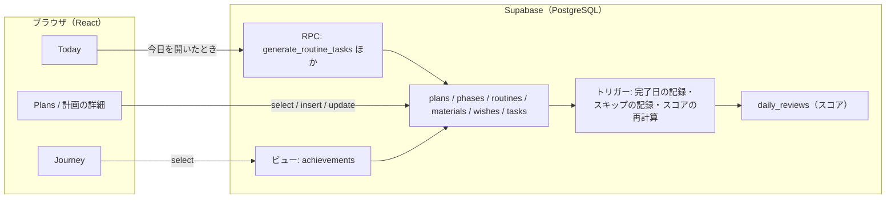
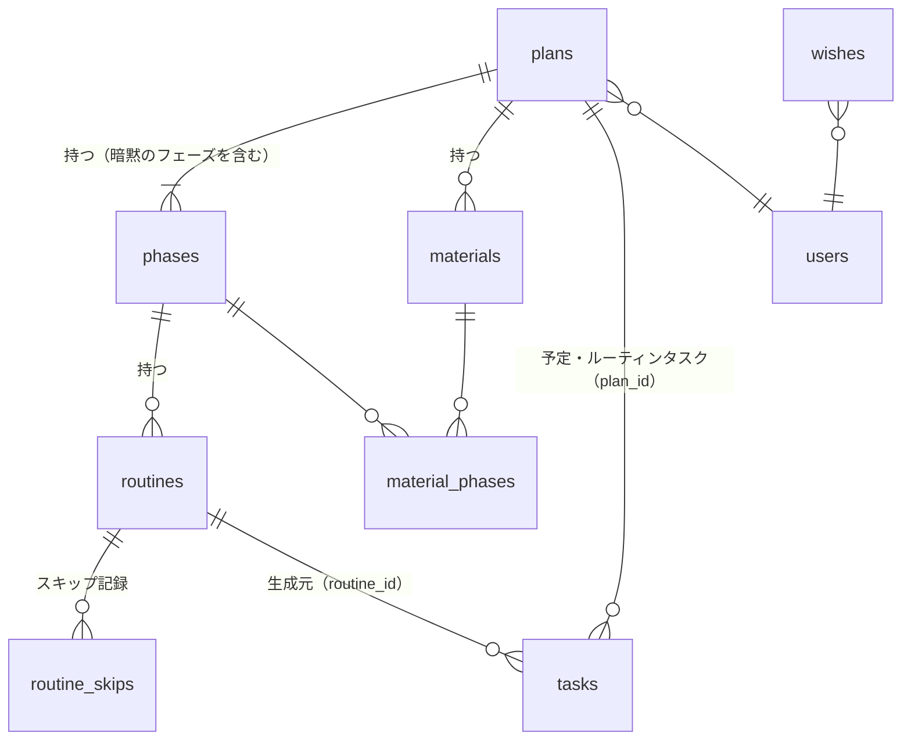
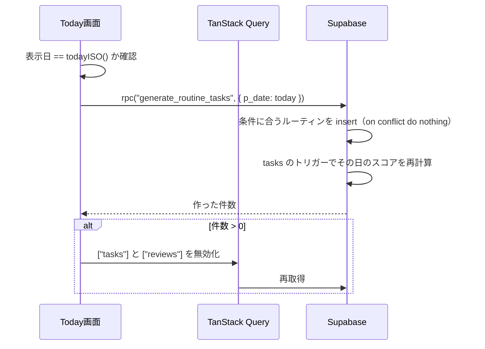

# 学習計画機能 技術設計書

| 項目 | 内容 |
| --- | --- |
| ステータス | 承認済み |
| 承認日 | 2026-09-29 |
| 作成者 | h1karu-446 |
| 作成日 | 2026-09-29 |
| 最終更新 | 2026-09-29 |
| 対応する文書 | [企画書（PRD）](../prd/study-plans.md) / [機能仕様書](../specs/study-plans.md) |

この文書は、機能仕様書の振る舞いをどう実装するかを定める。DB設計（テーブル・制約・RLS・関数）、フロントエンドの構成、重要な処理の流れ、マイグレーションの進め方を扱う。
画面の振る舞いそのものは機能仕様書を正とし、ここでは繰り返さない。

## 1. 前提と方針

- 既存の構成（React 18 + TanStack Query + Supabase、スコアはPostgreSQLの関数とトリガーで計算）を変えずに拡張する
- スコアの計算式（`calculate_daily_score`）と `src/lib/score.ts` には手を入れない（NFR-02）
- データの整合性に関わるルール（二重生成の防止、フェーズの重なり、完了日の記録）は、画面ではなくDBの制約とトリガーで守る。画面側のチェックは入力補助として重ねる
- 1ユーザー・少量データ（計画は数十件、タスクは年間数千件）を前提に、読み込みは「ユーザーの全件をまとめて取得し、画面側で絞り込む」既存の方式に合わせる
- migration は追記のみ（`docs/project-context.md` の制約）。リリースごとに1本ずつ追加する

## 2. 現状の構成と、今回見つかった問題

### 2.1 現状

| 要素 | 役割 |
| --- | --- |
| `tasks` | 日付ごとのタスク。`scheduled_date`、`importance`、`completed`、`start_time` / `end_time`、`memo` |
| `daily_reviews` | 日ごとの振り返りと、保存されたスコア（`total_score`、`cluster` など） |
| `calculate_daily_score` | その日のタスクと振り返りからスコアを計算する |
| `trg_update_scores`（`daily_reviews` の BEFORE INSERT/UPDATE） | 振り返りの保存時にスコアを計算して書き込む |
| `trg_touch_review_on_task`（`tasks` の AFTER INSERT/UPDATE/DELETE） | タスクが変わったら、その日の `daily_reviews.updated_at` を更新してスコアを再計算させる |
| RLS | `tasks` と `daily_reviews` は `auth.uid() = user_id` の行だけ読み書きできる |
| 「今日」の判定 | 端末のタイムゾーンで `todayISO()` を使う |

### 2.2 問題：日付を変えたとき、元の日のスコアが更新されない

`touch_daily_review_after_task_change` は UPDATE のとき `new.scheduled_date` の振り返りしか更新しない。
タスクの日付を変えると、**元の日（`old.scheduled_date`）のスコアが古いまま残る**。

今回の「今日に移す」（機能仕様書 BR-04）はまさにこの操作なので、リリース3の migration でトリガー関数を差し替え、日付が変わったときは元の日と新しい日の両方を更新する（4.4）。

## 3. 全体構成



- 画面からの読み書きは、既存と同じく supabase-js でテーブルを直接操作する（RLSで保護）
- 複数の行をまとめて整合性を保つ必要がある操作だけ、RPC（PostgreSQLの関数）にする：ルーティンの生成、フェーズの削除、計画の削除

## 4. DB設計

### 4.1 ER図



すべてのテーブルに `user_id`（`auth.users.id`）を持たせ、RLSの判定をテーブル単体で完結させる。

### 4.2 テーブル定義

共通の列：`id uuid primary key default gen_random_uuid()`、`user_id uuid not null references auth.users(id) on delete cascade`、`created_at timestamptz not null default now()`、`updated_at timestamptz not null default now()`。以下の表では省略する。

#### plans（計画）

| 列 | 型 | NULL | 既定 | 制約・説明 |
| --- | --- | --- | --- | --- |
| name | text | × | — | 1〜40文字（`char_length(btrim(name)) between 1 and 40`） |
| color | text | × | — | `pink / orange / yellow / green / teal / blue / purple / gray / coral / lime / indigo / brown` のいずれか |
| status | text | × | `'active'` | `idea / active / paused / done`（構想中／進行中／休止中／完了） |
| due_date | date | ○ | — | 期日 |
| goal | text | ○ | — | 目標。60文字まで |
| goal_note | text | ○ | — | 補足。1000文字まで |
| completed_at | date | ○ | — | 完了日。トリガーで設定（4.4） |
| overdue_notice_dismissed_for | date | ○ | — | 期日超過の案内を閉じたときの期日。`due_date` と等しい間は案内を出さない |

#### phases（フェーズ）

| 列 | 型 | NULL | 既定 | 制約・説明 |
| --- | --- | --- | --- | --- |
| plan_id | uuid | × | — | `references plans(id) on delete cascade` |
| name | text | ○ | — | 1〜30文字。暗黙のフェーズでは NULL |
| start_date | date | ○ | — | 暗黙のフェーズでは NULL |
| end_date | date | ○ | — | 暗黙のフェーズでは NULL |
| is_implicit | boolean | × | `false` | 暗黙のフェーズか |

- CHECK：`(is_implicit and name is null and start_date is null and end_date is null) or (not is_implicit and name is not null and start_date is not null and end_date is not null and start_date <= end_date)`
- 暗黙のフェーズは計画に1つまで：`unique (plan_id) where is_implicit`
- 期間の重なりの禁止：`exclude using gist (plan_id with =, daterange(start_date, end_date, '[]') with &&) where (not is_implicit)`（拡張 `btree_gist` を有効にする）
- 「暗黙のフェーズと通常のフェーズが同じ計画に並存しない」ことは、フェーズの追加・削除を 4.6 の手順に限ることで守る

#### routines（ルーティン）

| 列 | 型 | NULL | 既定 | 制約・説明 |
| --- | --- | --- | --- | --- |
| phase_id | uuid | × | — | `references phases(id) on delete cascade` |
| title | text | × | — | 1〜40文字 |
| minutes | integer | × | `30` | 5〜600、5の倍数 |
| weekdays | smallint[] | × | `'{1,2,3,4,5,6,7}'` | ISO曜日（1=月〜7=日）。1つ以上、各値 1〜7 |
| importance | text | × | `'中'` | `重 / 中 / 軽` |
| menu | text | ○ | — | 2000文字まで |

#### routine_skips（ルーティンのスキップ記録）

| 列 | 型 | NULL | 制約・説明 |
| --- | --- | --- | --- |
| routine_id | uuid | × | `references routines(id) on delete cascade` |
| date | date | × | スキップした日 |
| user_id | uuid | × | RLS用 |

- 主キー：`(routine_id, date)`。`id` / `updated_at` は持たない
- 行はトリガー（4.4）だけが作る

#### materials（教材）

| 列 | 型 | NULL | 既定 | 制約・説明 |
| --- | --- | --- | --- | --- |
| plan_id | uuid | × | — | `references plans(id) on delete cascade` |
| title | text | × | — | 1〜100文字 |
| url | text | ○ | — | `^https?://` に一致 |
| note | text | ○ | — | 学ぶこと・メモ。1000文字まで（`materials_note_length`、migration 0017、Issue #53）。空は NULL で保存 |
| status | text | × | `'todo'` | `todo / in_progress / done` |
| completed_at | date | ○ | — | トリガーで設定（4.4） |

#### material_phases（教材とフェーズの紐づけ）

| 列 | 型 | NULL | 制約・説明 |
| --- | --- | --- | --- |
| material_id | uuid | × | `references materials(id) on delete cascade` |
| phase_id | uuid | × | `references phases(id) on delete cascade` |
| user_id | uuid | × | RLS用 |

- 主キー：`(material_id, phase_id)`

#### wishes（やりたいこと）

| 列 | 型 | NULL | 既定 | 制約・説明 |
| --- | --- | --- | --- | --- |
| title | text | × | — | 1〜60文字 |
| note | text | ○ | — | 100文字まで |
| achieved_at | date | ○ | — | 達成した日。NULL なら未達成 |
| importance | text | × | `'中'` | `重` / `中` / `軽`（`wishes_importance_check`）。並びと見分けのためだけに使い、スコアと年の達成件数には影響しない（migration 0018、Issue #54） |
| emphasize_achievement | boolean | × | `false` | 達成の記録で強調するか。重要度とは独立。0018 の適用時点でのやりたいことは `true`（見た目を変えないため）、以後の新規は `false` |

#### tasks（既存テーブルへの追加列）

| 列 | 型 | NULL | 既定 | 制約・説明 |
| --- | --- | --- | --- | --- |
| plan_id | uuid | ○ | — | `references plans(id) on delete set null`。予定とルーティンタスクに入る |
| routine_id | uuid | ○ | — | `references routines(id) on delete set null`。ルーティンタスクだけに入る |
| planned_minutes | integer | ○ | — | 所要時間。ルーティンタスクで使う |
| is_milestone | boolean | × | `false` | マイルストーンの印 |
| carried_from | uuid | ○ | — | `references tasks(id) on delete set null`。持ち越しで作った複製が、元の予定を指す（migration 0014、Issue #36）。`tasks (carried_from) where carried_from is not null` の部分一意インデックスで、1つの予定の複製は1つだけ。RLS の `with check` は、複製元も本人のタスクであることを要求する（ポリシーの中で `tasks` を直接参照すると再帰エラーになるため、`security definer` の関数 `is_own_task` で確かめる） |

- 二重生成の防止：`create unique index tasks_routine_date_uniq on tasks (routine_id, scheduled_date) where routine_id is not null`
- 追加のインデックス：`tasks (plan_id) where plan_id is not null`

### 4.3 RLS

すべての新しいテーブルで RLS を有効にし、既存と同じ形のポリシーを置く。

```sql
create policy "<table>_owner_all" on public.<table> for all
  using (auth.uid() = user_id)
  with check (auth.uid() = user_id);
```

子テーブル（`phases`、`routines`、`materials`、`material_phases`）は、`with check` に「親の行も本人のものか」を加える。
他人の計画のIDを指定して行を作れないようにするため（例：`phases` なら `exists (select 1 from plans p where p.id = plan_id and p.user_id = auth.uid())`）。

### 4.4 トリガー

| トリガー | 対象 | 動き |
| --- | --- | --- |
| `set_updated_at` | 新しい全テーブルの BEFORE UPDATE | `updated_at = now()` |
| `plans_set_completed_at` | `plans` の BEFORE INSERT/UPDATE | `status` が `done` 以外なら `completed_at = NULL`。`done` で `completed_at` が NULL なら `current_date` を補う |
| `materials_set_completed_at` | `materials` の BEFORE INSERT/UPDATE | 同上（`status = 'done'`） |
| `plans_create_implicit_phase` | `plans` の AFTER INSERT | 暗黙のフェーズを1行作る |
| `tasks_record_routine_skip` | `tasks` の AFTER DELETE | `old.routine_id` があれば `routine_skips (old.routine_id, old.scheduled_date)` を作る（重複は無視） |
| `trg_touch_review_on_task`（差し替え） | `tasks` の AFTER INSERT/UPDATE/DELETE | 既存の動きに加え、UPDATE で `scheduled_date` が変わったときは `old.scheduled_date` の振り返りも更新する（2.2） |

完了日・達成日は、画面が端末の日付（`todayISO()`）を `completed_at` / `achieved_at` として送る。DBの `current_date` はUTCなので、日本時間の0〜9時に完了すると前日になってしまうため。トリガーの `current_date` は、値が送られなかったときの補完に限る。

### 4.5 ビュー

#### achievements（達成の記録）

機能仕様書 BR-09 の4種類を1つにまとめる。`security_invoker = true` を付け、元のテーブルのRLSをそのまま効かせる。

| 列 | 内容 |
| --- | --- |
| kind | `wish` / `plan` / `milestone` / `material` |
| id | 元の行のID |
| user_id | 所有者 |
| title | やりたいことのタイトル、計画名、予定のタイトル、教材のタイトル |
| achieved_on | 達成した日（`achieved_at`、`completed_at`、`scheduled_date`、`completed_at`） |
| plan_id / plan_name / plan_color | 紐づく計画（`wish` では NULL） |
| started_at | 計画の完了で期間を出すための作成日時（timestamptz、`plan` のみ）。画面で端末の日付に変換する。0009 の `started_on`（UTC 日付）を migration 0012 で置き換えた（Issue #34） |
| emphasized | やりたいことの `emphasize_achievement`（boolean、`wish` のみ。ほかの種類は NULL で、見せ方は種類で決まる）。migration 0018 で追加（Issue #54）。0012 と同じく drop → create し、`security_invoker = true` と GRANT を付け直した |

画面側は `achieved_on` の降順で3か月分ずつ取得する（`gte` / `lt` で月の範囲を指定）。

### 4.6 RPC（PostgreSQLの関数）

どれも `security invoker`（呼び出したユーザーの権限で実行し、RLSを効かせる）。

#### generate_routine_tasks(p_date date) returns integer

その日のルーティンタスクを作り、作った件数を返す（機能仕様書 BR-02）。

1. `p_date` が `current_date - 1` 〜 `current_date + 1` の範囲外なら例外を投げる。端末とDBのタイムゾーン差を許しつつ、過去や遠い未来の日付での生成を防ぐ（NFR-01）
2. 次の条件を満たすルーティンを選ぶ
   - 計画の `status = 'active'`
   - フェーズが暗黙のフェーズ、または `p_date between start_date and end_date`
   - `extract(isodow from p_date) = any(weekdays)`
   - `routine_skips` に `(routine_id, p_date)` がない
3. `tasks` に `insert ... select` する。値は `title`、`importance`、`planned_minutes = minutes`、`memo = menu`、`plan_id`、`routine_id`、`scheduled_date = p_date`、`completed = false`
4. `on conflict (routine_id, scheduled_date) where routine_id is not null do nothing` で二重生成を防ぐ（NFR-04）
5. 作った件数を返す

#### delete_phase(p_phase_id uuid) returns void

機能仕様書 BR-03 の「最後のフェーズを削除したら暗黙のフェーズに戻す」を1トランザクションで行う。

- 同じ計画に他の通常フェーズがあれば、そのフェーズを削除する（ルーティンと教材の紐づけは cascade で消える）
- 最後の1つなら、そのフェーズのルーティンと教材の紐づけを削除し、行を `is_implicit = true`（名前・期間は NULL）に更新する

最初のフェーズの追加は、暗黙のフェーズの行を `update`（`is_implicit = false`、名前と期間を設定）するだけで済むので、RPC にしない。ルーティンと教材の紐づけは同じ行に付いたまま引き継がれる。

#### delete_plan(p_plan_id uuid, p_today date) returns void

機能仕様書 BR-08 を1トランザクションで行う。

1. 計画に紐づくタスクのうち、`scheduled_date > p_today` かつ未完了のものを削除する
2. 計画を削除する。残ったタスクの `plan_id` / `routine_id` は `on delete set null` で外れる。スキップ記録（1で作られたものを含む）は cascade で消える

`p_today` も `generate_routine_tasks` と同じ範囲チェックを行う。

## 5. フロントエンド設計

### 5.1 ルーティング（`src/App.tsx`）

| パス | 画面 | 変更 |
| --- | --- | --- |
| `/`、`/day/:date` | `pages/Today.tsx` | 既存を変更 |
| `/plans` | `pages/Plans.tsx` | 新規 |
| `/plans/:id` | `pages/PlanDetail.tsx` | 新規 |
| `/journey` | `pages/Journey.tsx` | 新規 |
| `/calendar` | — | `<Navigate to="/journey" replace />` に置き換え、`pages/Calendar.tsx` は削除（カレンダー部分は Journey のコンポーネントに移す） |

`components/Layout.tsx` の `NAV` を `Today / Plans / Journey` にする。

### 5.2 ディレクトリ構成（追加分）

```text
src/
  pages/
    Plans.tsx            計画一覧
    PlanDetail.tsx       計画の詳細
    Journey.tsx          Journey
  components/
    plans/               PlanCard, PhaseBar, RoutineCard, ExecutionSquares,
                         ScheduleList, MaterialList, PlanFormModal, GoalPanel
    journey/             ScoreCalendar, WishList, AchievementTimeline, JourneyStats
    common/              InlineEditRow, CollapsibleList, EmptyAddButton, PlanBadge
  lib/
    plans/
      queries.ts         計画まわりの TanStack Query の hooks
      logic.ts           画面の計算（純粋関数。7章でテストする）
      logic.test.ts
    journey/
      queries.ts
      logic.ts
      logic.test.ts
```

画面の計算（今日のフェーズの特定、曜日の表記、実施マスの判定、並び順など）はコンポーネントに書かず、`logic.ts` の純粋関数にまとめる。既存の `score.ts` と同じく、Supabase に依存しないのでテストしやすい。

### 5.3 型（`src/types.ts` に追加）

```ts
export type PlanStatus = "idea" | "active" | "paused" | "done";
export type PlanColor =
  | "pink" | "orange" | "yellow" | "green" | "teal" | "blue" | "purple" | "gray";
export type MaterialStatus = "todo" | "in_progress" | "done";

export interface Plan {
  id: string; name: string; color: PlanColor; status: PlanStatus;
  due_date?: string; goal?: string; goal_note?: string; completed_at?: string;
  overdue_notice_dismissed_for?: string;
  phases: Phase[]; materials: Material[];
  created_at: string; updated_at: string;
}
export interface Phase {
  id: string; plan_id: string; is_implicit: boolean;
  name?: string; start_date?: string; end_date?: string;
  routines: Routine[];
}
export interface Routine {
  id: string; phase_id: string; title: string; minutes: number;
  weekdays: number[]; importance: Importance; menu?: string;
}
export interface Material {
  id: string; plan_id: string; title: string; url?: string;
  status: MaterialStatus; completed_at?: string; phase_ids: string[];
  created_at: string;
}
export interface Wish {
  id: string; user_id: string; title: string; note: string | null;
  achieved_at: string | null; importance: Importance;
  emphasize_achievement: boolean; created_at: string; updated_at: string;
}
export interface Achievement {
  kind: "wish" | "plan" | "milestone" | "material";
  id: string; user_id: string; title: string; achieved_on: string;
  plan_id: string | null; plan_name: string | null; plan_color: PlanColor | null;
  started_at: string | null; emphasized: boolean | null;
}
```

`Wish` と `Achievement` は、DB の行（`wishes` テーブル、`achievements` ビュー）と同じ形にする。値がない列は、Supabase が返すとおり `null` で表し、`user_id` も含める。これにより、取得した行を変換せずにそのまま使える（2026-09-30 に本人が決定。実装に合わせて設計を更新）。上の `Plan` などの既存の型は `?:` のまま残っているが、今後追加する型は DB の行と同じ形に寄せる。

`Task` に `plan_id?`、`routine_id?`、`planned_minutes?`、`is_milestone: boolean` を追加し、`queries.ts` の `TaskRow` / `rowToTask` も合わせて変える。

### 5.4 データ取得

| hook | クエリキー | 取得内容 |
| --- | --- | --- |
| `usePlans()` | `["plans"]` | `plans` を `phases(*, routines(*))` と `materials(*, material_phases(phase_id))` 付きで1回のselectで取得 |
| `useTasks()`（既存） | `["tasks"]` | 既存のまま全件。予定・実施マスの計算にも使う |
| `useReviews()`（既存） | `["reviews"]` | 既存のまま。Journey のカレンダーと統計に使う |
| `useWishes()` | `["wishes"]` | やりたいこと全件 |
| `useAchievements(months)` | `["achievements", months]` | `achievements` ビューを直近 N か月分 |
| `useEnsureRoutineTasks(date)` | — | Today 用。4.6 の RPC を呼ぶ（6.1） |

- 更新系の mutation は、成功時に関係するキーを無効化する。計画・フェーズ・ルーティン・教材の変更は `["plans"]`、予定（タスク）の変更は `["tasks"]` と `["reviews"]`（既存の `invalidateAll`）、完了やチェックは `["achievements"]` も
- 教材の状態のバッジのように、押してすぐ見た目を変えたい操作は、楽観的更新（`onMutate` でキャッシュを先に書き換え、失敗したら戻す）にする

### 5.5 Today の変更

| 変更 | 実装 |
| --- | --- |
| ルーティンの生成 | `Today.tsx` で `useEnsureRoutineTasks(date)` を呼ぶ（6.1） |
| タスクの行の2行目 | `TaskRow` に `plan`（`usePlans()` から `plan_id` で引いた計画）を渡し、計画名とメモの1行要約を出す。メモの要約（改行を「 / 」に）は `logic.ts` の関数にする |
| タイムライン | `UnscheduledPanel` を `TasksPanel` の中、`TimelineView` の左に移す。ドロップ時、`planned_minutes` があれば `end_time = start_time + planned_minutes` にする |
| 振り返りの統合 | `ReviewPanel` を廃止し、`SummaryPanel` に充実度・ハイライト・明日の意図の入力を追加。起床時刻と同じ debounce（500ms）の自動保存にする。レビューのメモは送らない（既存の値を上書きしないよう、upsert の対象列から外す） |

## 6. 重要な処理の流れ

### 6.1 ルーティンの生成



- 呼び出しは「その日付で一度だけ」にする（`useRef` に呼んだ日付を覚える）。日付をまたいで開きっぱなしのときは、表示日が変わった時点で再び呼ばれる
- 失敗しても画面は通常どおり表示し、コンソールに記録するだけにする（生成は次に開いたときにやり直せる）
- 生成前に表示されたタスク一覧に、数百ミリ秒後にルーティンタスクが加わる。読み込み中の表示は出さない

### 6.2 期限切れの予定を「今日に移す」

Issue #36 で「移動」から「複製」に変えた（仕様 BR-04）。

1. 画面が、元の予定と同じ内容（タイトル、重要度、`plan_id`、`is_milestone`、`memo`、`planned_minutes`）で、`scheduled_date = today`、`carried_from = 元の id` のタスクを `tasks.insert` する（`carryOverInput`）。元の予定は更新しない
2. トリガーは今日の振り返りだけを更新する。元の日のスコアは変わらない
3. `["tasks"]` と `["reviews"]` を無効化する。一覧は `carried_from` から持ち越し済みの予定を求め、期限切れから外す（`carriedIds`、`scheduleGroups`）
4. 過去の予定の編集は `planScheduleSave` で送る内容を決める（タイトルだけ。期限切れの予定で日付を今日以降にしたときは、上と同じ複製を作る）

### 6.3 ルーティンタスクの削除

1. Today で削除すると、既存どおり `tasks.delete()` を送る
2. `tasks_record_routine_skip` トリガーが `routine_skips` に記録する
3. 次に `generate_routine_tasks` を呼んでも、スキップ記録があるので作られない

## 7. 非機能要件への対応

| 要件 | 対応 |
| --- | --- |
| NFR-01 過去を変えない | RPC の日付の範囲チェック、予定の日付を今日以降に限る入力チェック（画面）、計画の削除で過去のタスクを残す（`delete_plan`） |
| NFR-02 スコア計算を変えない | `calculate_daily_score` と `score.ts` に手を入れない |
| NFR-03 既存データを残す | 既存の列は削除しない。`daily_reviews.memo` は画面から送らないだけ |
| NFR-04 二重生成しない | `tasks (routine_id, scheduled_date)` の部分一意インデックスと `on conflict do nothing` |
| NFR-05 本人だけ | 全テーブルの RLS と、子テーブルの親所有チェック（4.3） |
| NFR-06 表示を遅くしない | 生成はタスク一覧の表示を待たせない非同期処理にする。RPC は1回の insert ... select |
| NFR-07 PC ブラウザ | 既存と同じ |
| NFR-08 見た目 | 既存の Tailwind のクラスとトークン（`notion.*`）を使う。計画の12色は `src/lib/plans/colors.ts` で定義する |

## 8. リスクと対策

| リスク | 影響 | 対策 |
| --- | --- | --- |
| 端末とDBで「今日」がずれる | 日本時間の0〜9時にDBの `current_date` は前日になる | 日付はすべて画面から送る（生成日、完了日、今日に移す）。RPC は±1日の範囲を許す |
| トリガーの差し替えで既存の動きが壊れる | スコアの再計算が漏れる | 差し替えは「old の日付も更新する」処理の追加だけにする。migration 適用後に、日付変更と通常の完了の両方で `daily_reviews` の値を確認する |
| `btree_gist` 拡張が使えない | フェーズの重なり制約を作れない | Supabase では有効化できる。使えない場合は、フェーズの insert/update トリガーで重なりを検査する方式に切り替える |
| `useTasks()` が全件取得のまま | 数年分で件数が増えると重くなる | 当面は問題にならない件数（年間数千件）。遅くなったら期間で絞る取得に変える（今回は対象外） |
| 生成タイミングの競合 | 2つのタブで同時に開くと二重に作られる | 部分一意インデックスで防ぐ |

## 9. マイグレーションとリリース

リリースごとに migration を1本追加する（企画書のリリース計画と対応）。

| リリース | migration | 内容 |
| --- | --- | --- |
| 1. Today の見直し | なし | 画面の変更だけ |
| 2. 計画とルーティン | `0007_study_plans.sql` | `btree_gist` の有効化、`plans` / `phases` / `routines` / `routine_skips`、`tasks` の `plan_id` / `routine_id` / `planned_minutes`、部分一意インデックス、RLS、トリガー（updated_at、completed_at、暗黙のフェーズ、スキップ記録）、`generate_routine_tasks`、`delete_phase`、`delete_plan` |
| 3. 予定と教材 | `0008_materials_and_milestones.sql` | `materials` / `material_phases`、`tasks.is_milestone`、`trg_touch_review_on_task` の差し替え（2.2） |
| 4. Journey | `0009_wishes_and_achievements.sql` | `wishes`、`achievements` ビュー |
| Issue #36 | `0014_task_carry_over.sql` | `tasks.carried_from`、部分一意インデックス、`is_own_task`、`tasks_owner_all` の差し替え |
| Issue #54 | `0018_wish_importance_emphasis.sql` | `wishes.importance`・`wishes.emphasize_achievement`、`achievements.emphasized`（ビューの drop → create） |

- 検証はDocker上のローカルSupabaseへ適用して行う。Issue #5で既存migration 0001〜0006を準備し、0007以降は各Issueで扱う。環境の切り替えは [プロジェクト固有Context](../project-context.md) を参照する
- 現在のSupabaseでは新しいテーブルがData APIに自動公開されない。新規テーブルを使うロールへの明示的な `GRANT` とRLSを各migrationで設定する。既存2テーブルのローカル権限はIssue #5の専用SQLで補う
- 本番への適用は `supabase db push`（またはダッシュボードのSQLエディタ）。ローカル検証とは分け、対象プロジェクトと実行許可を確認する。手順と確認項目はリリース手順書に書く
- どの migration も列やテーブルを追加するだけで、既存の列を変えない。画面側を戻せば、DBを戻さなくても以前の動きになる（新しい列は NULL 可か既定値あり）
- `delete_plan` がリリース3以降の `is_milestone` などに依存しないよう、関数はリリース2の時点の列だけで書く

## 10. 検討した代替案（ADR）

| # | 判断 | 採用 | 主な代替案 |
| --- | --- | --- | --- |
| [ADR-0001](../adr/0001-schedule-as-task.md) | 予定の持ち方 | `tasks` の1行（`plan_id` 付き） | 予定テーブルを別に作り、当日に生成する |
| [ADR-0002](../adr/0002-generate-routine-tasks-on-open.md) | ルーティンを生成する場所とタイミング | 今日を開いたときに RPC で生成 | 画面側で insert を並べる／毎朝の定期実行（cron） |
| [ADR-0003](../adr/0003-routine-skip-by-delete-trigger.md) | 削除したルーティンタスクの再生成防止 | 削除トリガーでスキップ記録を作る | タスクを論理削除（フラグ）にする |
| [ADR-0004](../adr/0004-implicit-phase.md) | フェーズを作らない計画の扱い | 暗黙のフェーズを1つ持たせる | ルーティンを計画にも直接ぶら下げられるようにする |
| [ADR-0005](../adr/0005-achievements-view.md) | 達成の記録の集め方 | ビューで4種類をまとめる | 達成イベントのテーブルに書き込む |

各判断の詳細は [docs/adr/](../adr/README.md) に1件1ファイルで書いている。

## 11. 未決事項

- [x] 計画の12色の具体的な色コードは `src/lib/plans/colors.ts` で定義する。ライト・ダーク双方で色名を併記する
- [ ] `usePlans()` の取得を、計画の詳細では1件だけの取得に分けるか（当面は全件取得で十分と見ている）

## 変更履歴

| 日付 | 内容 |
| --- | --- |
| 2026-09-29 | 初版作成、承認 |
| 2026-09-30 | Issue #54：`wishes` に重要度と達成の強調を追加、`achievements` に `emphasized` を追加（4.2、4.5、5.3、9章） |

### 実装上の型の補足（Issue #12）

`Wish` と `Achievement` はRESTで返るDB行をそのまま扱い、nullable列をoptionalではなく `| null` とし、RLS検証やデータ対応を追えるよう `user_id` を含める。フィードの識別子は `(kind, id)`。他の画面の既存型への変更は不要。
