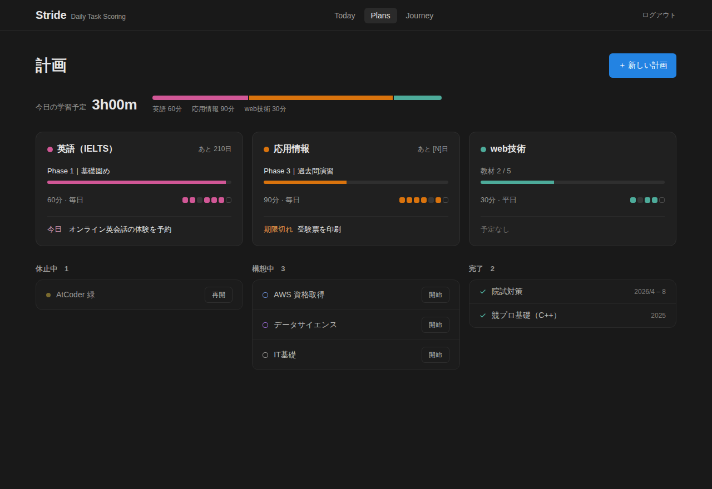
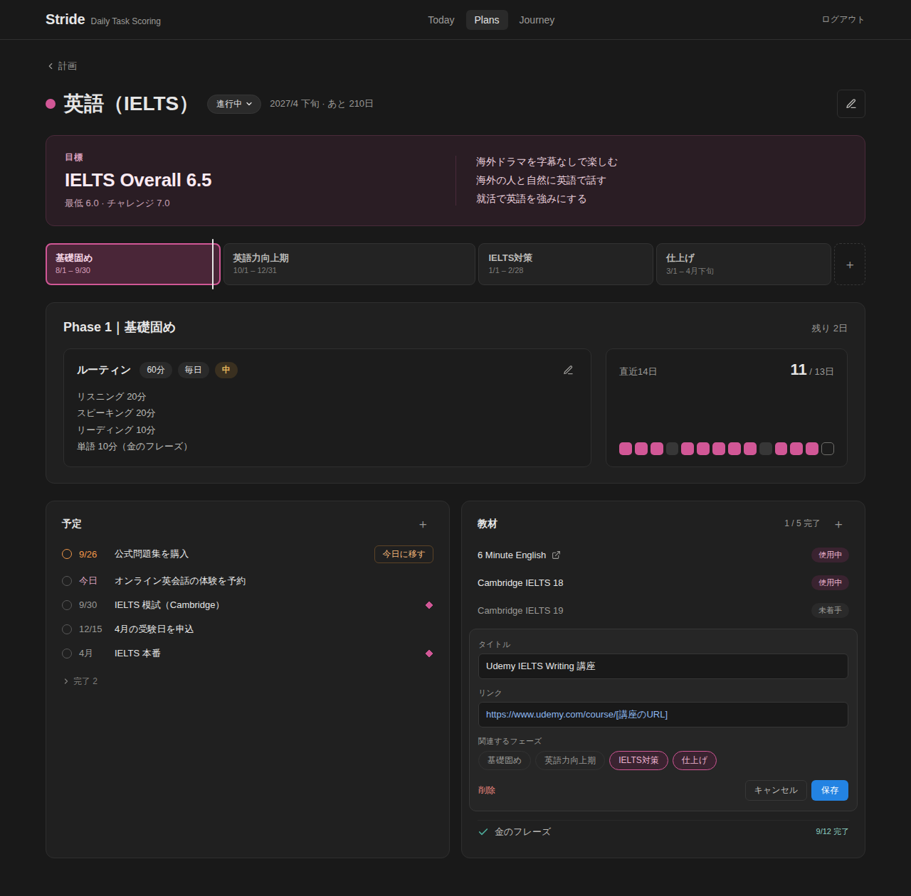
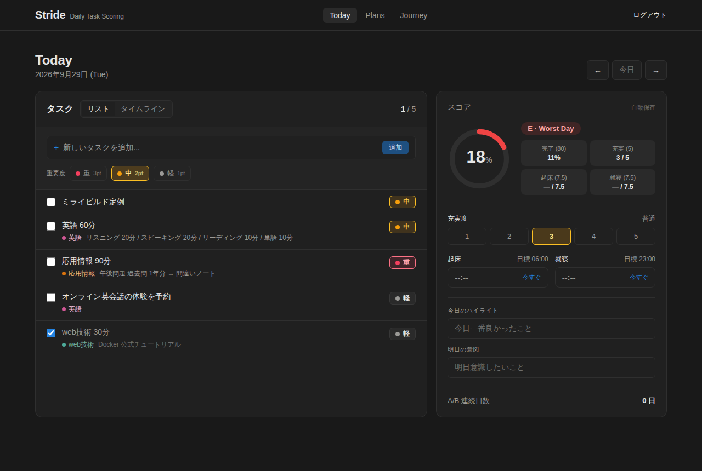
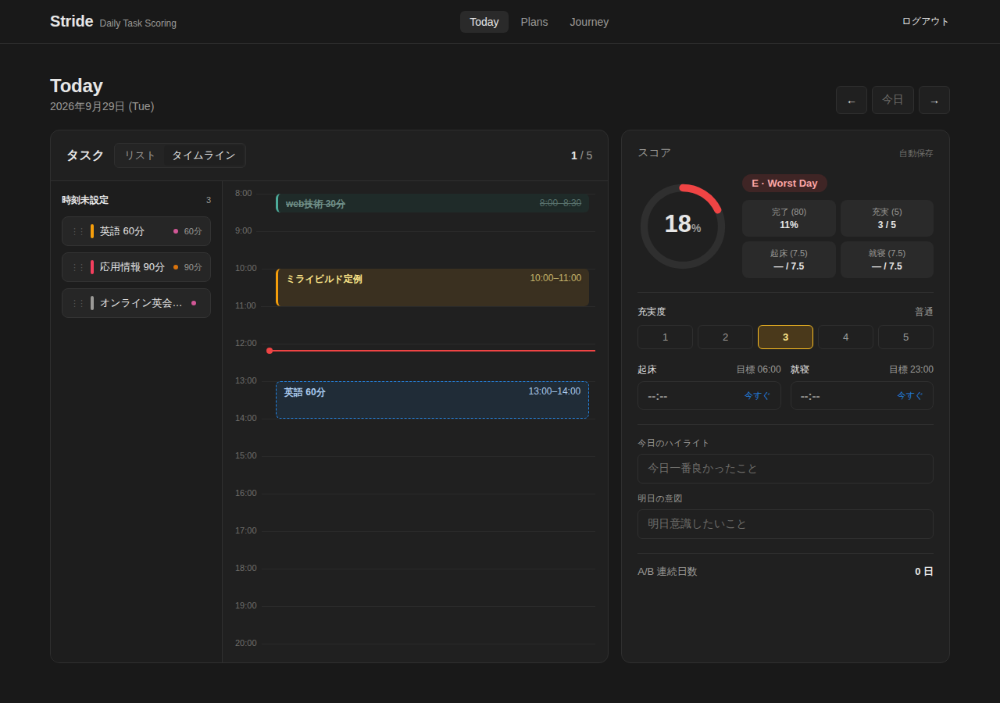
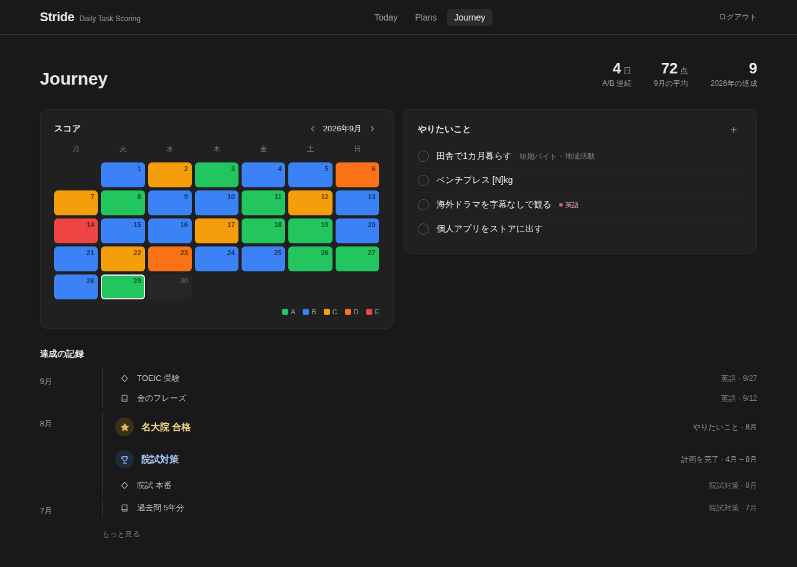
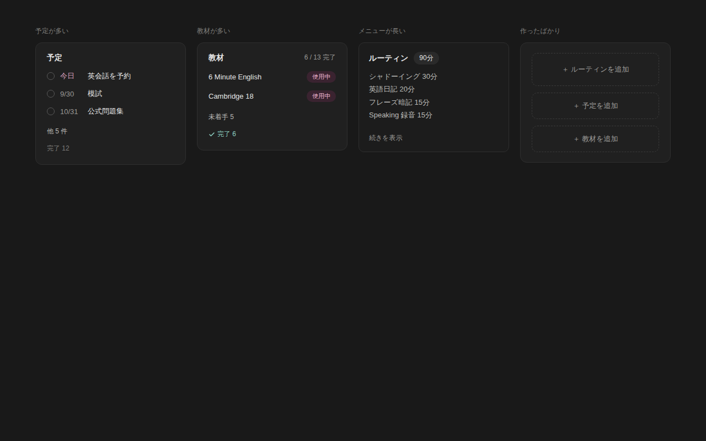

# 学習計画機能 デザインモック

[企画書](../../prd/study-plans.md)の各画面の見た目。振る舞いの詳細は機能仕様書（作成予定）に書く。

- 各画面の HTML はブラウザで開くと確認できる。画面間のリンク（ナビ、カード、戻る）も動く
- 表示しているデータはサンプル。応用情報の試験日など未確定の値は `[N]` のように仮置きしている
- 元のモックは Claude のデザインキャンバスで作成した。変更したらこのフォルダの HTML と PNG も更新する

| # | 画面 | HTML | 主な確認点 |
| --- | --- | --- | --- |
| 1 | 計画一覧（Plans） | [01-plans.html](01-plans.html) | 今日の学習予定の合計、進行中の計画カード、休止中・構想中・完了の一覧 |
| 2 | 計画の詳細 | [02-plan-detail.html](02-plan-detail.html) | 目標、フェーズの帯、ルーティンと直近14日、予定、教材（編集フォームを開いた状態） |
| 3 | Today（リスト表示） | [03-today-list.html](03-today-list.html) | 計画から入ったタスクの2行目、スコア欄に統合した振り返り |
| 4 | Today（タイムライン表示） | [04-today-timeline.html](04-today-timeline.html) | 時刻未設定の列とドロップ先の表示 |
| 5 | Journey | [05-journey.html](05-journey.html) | スコアのカレンダー、やりたいこと、達成の記録（2段階の強調） |
| 6 | 量が多い・少ないとき | [06-content-states.html](06-content-states.html) | 折りたたみ、長いメニューの省略、空の状態 |

## 1. 計画一覧

## 2. 計画の詳細

## 3. Today（リスト表示）

## 4. Today（タイムライン表示）

## 5. Journey

## 6. 量が多い・少ないとき

