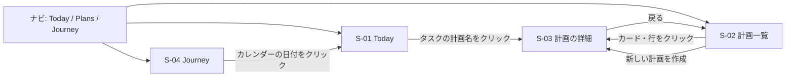
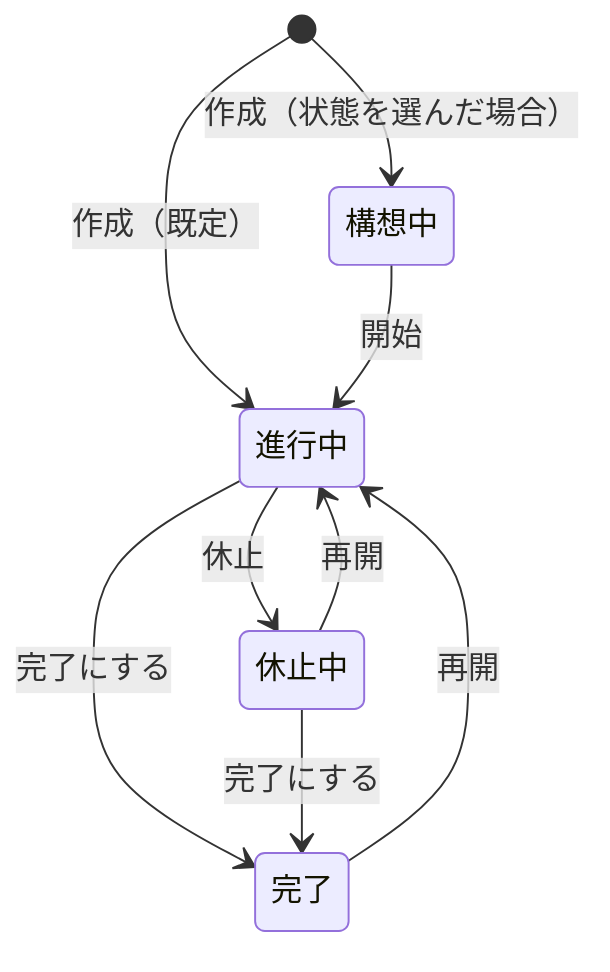

# 学習計画機能 機能仕様書

| 項目 | 内容 |
| --- | --- |
| ステータス | 承認済み |
| 承認日 | 2026-09-29 |
| 作成者 | h1karu-446 |
| 作成日 | 2026-09-29 |
| 最終更新 | 2026-09-29 |
| 対応する企画書 | [企画書（PRD）](../prd/study-plans.md) |
| デザイン | [デザインモック](../mocks/study-plans/README.md) |

この文書は、ユーザーから見た画面ごと・操作ごとの振る舞いと、画面をまたぐ業務ルールを定める。
実装の方法（テーブル定義、RPC、コンポーネント構成）は技術設計書に書く。
各仕様には対応する要件番号（FR / NFR）を付ける。

## 1. 用語

| 用語 | 意味 |
| --- | --- |
| 計画 | 1つの学習テーマの長期計画（例：英語、応用情報）。状態・色・期日・目標を持つ |
| 目標 | 計画のゴール。1行の「目標」と、自由記述の「補足」からなる |
| フェーズ | 計画を期間で区切った段階。開始日と終了日を持つ。作らなくてもよい |
| 暗黙のフェーズ | フェーズを作っていない計画が内部で1つだけ持つフェーズ。画面には出ない |
| ルーティン | フェーズに属する毎日の学習。所要時間・曜日・重要度・メニューを持つ |
| ルーティンタスク | ルーティンからTodayに自動で作られたタスク |
| 予定 | 計画に紐づく日付付きのタスク。作った時点でその日付のタスクになる |
| マイルストーン | 印を付けた予定。達成の記録に載る |
| 期限切れ | 日付が今日より前で、未完了で、まだ持ち越していない予定 |
| 持ち越し | 期限切れの予定を、今日以降の日付へ複製すること。元の予定は元の日に未完了のまま残る（BR-04） |
| 持ち越し済み | 持ち越しの複製がある元の予定。期限切れとしては扱わない |
| 教材 | 計画で使う参考書・講座など。状態（未着手／使用中／完了）を持つ |
| やりたいこと | 計画とは別に持つ夢や気軽な目標。達成したらチェックする |
| 達成の記録 | Journeyに時系列で並ぶ、達成したことの一覧 |

## 2. 画面一覧と遷移

| ID | 画面 | パス | 備考 |
| --- | --- | --- | --- |
| S-01 | Today | `/`、`/day/:date` | 既存。変更あり |
| S-02 | 計画一覧（Plans） | `/plans` | 新規 |
| S-03 | 計画の詳細 | `/plans/:id` | 新規 |
| S-04 | Journey | `/journey` | 新規。既存のCalendarを置き換える |
| — | Calendar | `/calendar` | 廃止。`/journey` へリダイレクトする |
| — | 設定 | `/settings` | 変更なし |

## 3. 共通仕様

### 3.1 ナビゲーション

- ヘッダーのナビは `Today / Plans / Journey` の3つにする（既存の Calendar を置き換える）
- 現在の画面に当たる項目を強調表示する。計画の詳細（S-03）では Plans を強調する

### 3.2 計画の色

- 計画ごとに、次の12色から1色を選ぶ：ピンク、オレンジ、イエロー、グリーン、ティール、ブルー、パープル、グレー、コーラル、ライム、インディゴ、ブラウン。選択欄には色名と選択枠も表示する
- 新しい計画の既定色は、進行中の計画でまだ使われていない色のうち、上の順で最初のもの。すべて使われていればピンク
- 色は計画一覧のカード、計画の詳細、Todayのタスクの計画名、Journeyのバッジで同じものを使う

### 3.3 日付の表示

| 条件 | 表示 |
| --- | --- |
| 今日 | 「今日」 |
| 今年の日付 | `M/D`（例：9/30） |
| 今年以外 | `YYYY/M/D` |
| 残り日数（期日の前日まで） | 「あと N日」 |
| 残り日数（期日当日） | 「今日が期日」 |
| 残り日数（期日を過ぎた） | 「期日を過ぎています」 |

「今日」の判定は、端末のタイムゾーンでの日付を使う（既存の `todayISO()` と同じ）。

計画の期日・フェーズ期間・予定の日付は共通の月カレンダーで選択する。表示は日本語の日付、保存は `YYYY-MM-DD`。予定は選べる最も早い日より前を無効にする。月・年送り、今日選択、矢印キーによる日移動、PageUp/Downによる月移動、Shift+PageUp/Downによる年移動、Escapeと外側クリックでの閉じ方を揃える。

### 3.4 表示量のルール

- ページ全体をスクロールさせ、カードの中ではスクロールさせない
- 件数が多い一覧は、決めた件数で打ち切り、残りを「他 N件」「完了 N」などのボタンに折りたたむ
- 折りたたみのボタンを押すと、その場で展開する。ラベルは「閉じる」に変わる。画面を離れると折りたたんだ状態に戻る
- 長い文章は行数で切り、「続きを表示」で展開する。1行の見出しは末尾を「…」で省略する
- 空の欄は高さを引き伸ばさず、点線の「＋ 追加」ボタンだけを置く
- 同じ行に並ぶカードは高さを揃える

### 3.5 保存とエラー

| 操作 | 保存のタイミング |
| --- | --- |
| 状態の切り替え（計画の状態、教材の状態、やりたいことのチェック） | 押した時点で保存（教材はメニューで値を選んだ時点） |
| 編集フォーム（計画、フェーズ、ルーティン、予定、教材、やりたいこと） | 「保存」を押した時点で保存 |
| Todayの振り返り（充実度、ハイライト、明日の意図） | 入力が止まってから500ms後に自動保存。ハイライト・意図はEnterで直ちに保存 |
| Todayの起床・就寝実績 | 有効な時刻を確定した時点で自動保存 |

- 保存に失敗したときは、入力内容を消さずにエラーメッセージ「保存できませんでした。もう一度お試しください」を表示する
- 必須項目が空のとき、「保存」ボタンは押せない

### 3.6 行のクリックと編集

- 予定・やりたいことの行は、クリックするとその場で編集フォームに変わる（別画面やポップアップは出さない）。教材は行の右端の「編集」ボタンで同じように開く（タイトルはリンクに使うため。Issue #53）
- 編集フォームは下部に、左から「削除」、右に「キャンセル」「保存」を並べる
- 同時に開ける編集フォームは1つだけ。別の行をクリックすると、開いていたフォームは破棄して閉じる
- Escキーで「キャンセル」と同じ動きをする

## 4. 画面仕様

### 4.1 S-02 計画一覧

対応要件：FR-01, FR-02, FR-14

#### 表示要素

| # | 要素 | 内容 |
| --- | --- | --- |
| 1 | 見出し | 「計画」と「＋ 新しい計画」ボタン |
| 2 | 今日の学習予定 | 今日Todayに入るルーティンの所要時間の合計（例：3h00m）と、計画ごとの内訳を色付きの帯で表示。対象は BR-02 の生成条件を満たすルーティン。0分なら欄ごと表示しない |
| 3 | 進行中の計画 | 進行中の計画をカードで3列に並べる |
| 4 | 休止中・構想中・完了 | 3列の一覧。各列の見出しに件数を出す。0件の列は「なし」とだけ表示する |

#### 進行中の計画カード

| 部分 | 表示 |
| --- | --- |
| 1行目 | 色の丸、計画名（1行で省略）、残り日数（期日がある場合だけ。3.3の表記） |
| 2行目 | 今日を含むフェーズが1件なら名前と経過率の進捗バー。複数なら名前を並べて件数を示す。フェーズがない計画は、教材の完了数（例：教材 2 / 5）と完了率のバー。教材もなければこの行を出さない |
| 3行目 | ルーティンの所要時間と曜日（例：60分 · 毎日）と、直近7日の実施マス（BR-06） |
| 4行目 | 次の予定を1件。期限切れがあれば「期限切れ」と最も古い期限切れの予定を優先して出す。なければ最も近い未完了の予定。予定がなければ「予定なし」。持ち越し済みの予定は出さない（複製のほうを数える） |

- 曜日の表記：全曜日なら「毎日」、月〜金なら「平日」、土日なら「土日」、それ以外は「月水金」のように並べる
- ルーティンが複数あるときは所要時間の合計を出し、曜日は表示しない
- 今日を含むフェーズがない（フェーズの期間外）ときは、2行目に「フェーズ期間外」、3行目に「今日のルーティンなし」と出す
- 並び順：期日が近い順。期日がない計画はその後ろ。同じ条件なら作成日の古い順
- カード全体をクリックすると計画の詳細（S-03）に移る

#### 休止中・構想中・完了の一覧

| 列 | 行の表示 | ボタン |
| --- | --- | --- |
| 休止中 | 色の丸（薄く）、計画名 | 「再開」：状態を進行中にする |
| 構想中 | 色の枠線だけの丸、計画名 | 「開始」：状態を進行中にする |
| 完了 | チェック、計画名、期間（作成月〜完了月） | なし |

- 行（ボタン以外）をクリックすると計画の詳細（S-03）に移る
- 各列は5件まで表示し、残りは「他 N件」に折りたたむ
- 並び順：休止中・構想中は更新日の新しい順、完了は完了日の新しい順

#### 新しい計画の作成

1. 「＋ 新しい計画」を押すと、作成フォームをモーダルで開く
2. 入力項目：計画名（必須）、色（既定は3.2）、状態（既定は進行中）、期日（任意）。期日は「期限なし」から「＋ 期日を設定」で開き、設定後も解除できる
3. 「作成」を押すと計画を作り、その計画の詳細（S-03）に移る。この時点では暗黙のフェーズを1つ持ち、ルーティン・予定・教材はない

#### 空の状態

- 計画が1件もないとき：「まだ計画がありません」と「＋ 新しい計画」ボタンだけを中央に表示する
- 進行中の計画がないとき：進行中の欄に「進行中の計画はありません」と表示する

### 4.2 S-03 計画の詳細

対応要件：FR-01〜FR-05, FR-09〜FR-13, FR-15, FR-16

画面は上から、ヘッダー → 目標 → フェーズの帯 → 選択中のフェーズ → 予定・教材（2列）の順に並ぶ。

#### ヘッダー

| 要素 | 仕様 |
| --- | --- |
| 戻る | 「計画」リンク。計画一覧に戻る |
| 計画名 | 色の丸と計画名。丸は色パレット、名前は短文のその場編集を開く |
| 状態 | 現在の状態を表示するボタン。押すと 構想中／進行中／休止中／完了 を選ぶメニューが開き、選ぶと即時保存（BR-01） |
| 期日 | 日付選択ボタンと残り日数（3.3）。未設定時も「＋ 期日を設定」を表示し、設定後は解除できる |
| その他 | 「計画を削除」を含むメニュー。削除前に影響範囲を示して確認する |

#### 期日を過ぎたときの案内

- 進行中の計画で、期日を過ぎているとき、ヘッダーの下に「期日を過ぎました。この計画を完了にしますか？」と「完了にする」ボタンを表示する（FR-16、BR-07）
- 「完了にする」を押すと状態を完了にする。案内は閉じるボタンで非表示にでき、その計画では次に期日を変えるまで出さない

#### 到達目標・目指す姿

- 計画の色を薄く敷いた欄に、左に短く明確な到達目標（例：IELTS 7.0）、右に「できるようになりたいこと」を目指す姿として箇条書き表示する（FR-03）
- それぞれ表示位置をクリックして編集。未設定なら「＋ 到達目標を設定」「＋ 目指す姿を追加」を表示する
- 到達目標は1行60文字以内。Enterで保存、Escapeで取消。目指す姿は1項目でも箇条書きを必須とし、Enterで次の項目、空項目のBackspaceで削除、複数行貼り付けで項目に分割、上下ボタンで並び替える。リスト全体を保存/取消する
- 既存の `goal_note` は改行ごとに箇条書き項目として読み、記号があれば表示時に除く。本人が保存するまでDB値は変えない。表示は6項目までとし、それを超えたら「続きを表示」

#### フェーズの帯

| 仕様 | 内容 |
| --- | --- |
| 表示条件 | 暗黙のフェーズしかない計画では、帯ごと表示しない |
| 並びと幅 | 全フェーズを共通の日付軸上に1行ずつ表示する。期間が重なる場合は上下の帯が同じ日付範囲を占め、空く日付は薄い背景と「空白 N日」で示す |
| 各フェーズ | 名前と期間（M/D – M/D）。終了日が今日より前のフェーズは文字を薄くする |
| 今日の線 | 今日が表示範囲に入る場合、全行を貫く縦線を引く |
| 選択 | 押したフェーズを選択中にする（計画の色の下線）。初期値は今日を含むフェーズのうち開始日が最も早いもの、なければ今日より後で最も近いフェーズ、それもなければ最後のフェーズ |
| 追加 | 右端の「＋」でフェーズの追加フォームを開く（BR-03） |
| 多いとき | 帯の幅に収まらない場合は横にスクロールさせる（この帯だけの例外） |
| 期間の操作 | 帯の中央をドラッグして全体を移動、両端をドラッグして開始日・終了日を日単位で調整する。左右キーでも1日ずつ調整できる。操作後に設定パネルで日付を確認して保存する |

#### 選択中のフェーズ

- 見出し：フェーズ名と、今日を含むフェーズなら「残り N日」、未来なら「M/D から」、過去なら「終了」。名前または編集ボタンで、名前・期間・複数メニューをまとめる設定パネルを開く。未作成時は「最初のフェーズを設定」を主操作、「フェーズなしで使う」を副操作として表示する
- 暗黙のフェーズしかない計画では、見出しを出さず、ルーティンと実施マスだけを表示する
- 左にルーティン、右に直近14日の実施マスを並べる

**ルーティン**（FR-05）

| 表示 | 内容 |
| --- | --- |
| 1行目 | 短い「メニュー」、所要時間、曜日（4.1の表記）、既定の重要度、編集ボタン |
| 2行目以降 | メニューの詳細（改行を保持）。4行を超えたら「続きを表示」 |

- ルーティンは1つのフェーズに複数置ける（例：平日30分と土日90分）。複数あるときは縦に並べる
- ルーティンがないときは「＋ メニューを追加」を表示する。通常フェーズでは、そのフェーズの設定パネルへ移る
- フェーズ設定パネルは作成・編集で同じ構造とし、名前・開始日→終了日・メニュー一覧を1回で保存する。メニューは複数追加・編集・削除でき、各項目に短いメニュー名、所要時間、曜日、重要度、任意の詳細を置く。進行中のフェーズは「今日でこのフェーズを終える」で終了日を今日にでき、保存まで取り消せる。次のフェーズの日付は自動変更しない。保存は `save_phase_settings` RPC の1トランザクションで行い、失敗時は全項目のdraftを保持する。未保存で別フェーズへ移るときは破棄を確認する
- フェーズなしの暗黙フェーズでは、従来の単独メニューフォームを利用する

**直近14日の実施マス**（FR-15、BR-06）

- 今日を含む直近14日を1日1マスで左から古い順に並べ、右上に「実施日数 / 対象日数」を出す（今日は数えない）

#### 予定（FR-09〜FR-11）

| 仕様 | 内容 |
| --- | --- |
| 並び順 | 期限切れ（古い順）→ 今日 → 未来（近い順） |
| 表示件数 | 未完了を3件まで。残りは「他 N件」に折りたたむ。完了済みと持ち越し済みは「完了 N」（持ち越し済みがあれば「完了 N · 持ち越し M」）に折りたたみ、開くと日付の新しい順に並ぶ。完了は✓、持ち越し済みは→と「持ち越し」の文字を灰色で付ける |
| 行の表示 | 状態（○。操作はできない）、日付（3.3。期限切れはオレンジ、今日は計画の色）、タイトル、マイルストーンなら◇ |
| 期限切れ | 右端に「今日に移す」ボタン。押すと今日の日付に複製を作る。元の予定は元の日に未完了のまま残り、持ち越し済みになる（BR-04） |
| 完了の操作 | この画面では完了にできない。完了はTodayで行う（BR-04） |
| 追加 | 見出しの「＋」で、一覧の先頭に空の編集フォームを開く。日付の既定は今日 |
| 編集 | 行をクリックすると編集フォーム（タイトル、日付、重要度、マイルストーン、削除）になる（3.6） |
| 過去の予定の編集 | 日付が今日より前の予定は、タイトルだけ変更できる。重要度・マイルストーンは押せず、「削除」は出さない。送る内容もタイトルだけにする。期限切れの予定に限り、日付を今日以降に変えて保存すると、その日に複製を作る（ボタンは「複製して保存」。元の予定の日付は変わらない）。完了済み・持ち越し済みの予定の日付は変えられない（BR-04） |

#### 教材（FR-12、FR-13）

| 仕様 | 内容 |
| --- | --- |
| 見出し | 「教材」、完了数（例：1 / 5 完了）、「＋」 |
| 並び順 | 選択中のフェーズに紐づく教材と、どのフェーズにも紐づかない教材を上に並べる。その中は 使用中 → 未着手、同じ状態なら追加順 |
| 折りたたみ | 他のフェーズだけに紐づく教材は「他のフェーズ N」、完了した教材は「完了 N」に折りたたむ。完了は✓と完了日付きで、完了日の新しい順 |
| 行の表示 | 左から タイトル（下に「学ぶこと・メモ」）、状態のバッジ、右端に「編集」ボタン。タイトル・バッジ・編集の押せる範囲は重ねない。長いタイトルは2行で省略（全文はマウスを重ねると出る） |
| タイトル | リンクがあれば、タイトル全体が新しいタブで開くリンク（下線と ↗ の印、読み上げ名に「新しいタブで開く」）。リンクがなければ押せない文字 |
| 学ぶこと・メモ | 入力があればタイトルの下に小さく表示し、最大2行で省略する。はみ出すときだけ「全文を表示」（押すと全文、「閉じる」で戻る）。改行はそのまま表示 |
| 状態のバッジ | 押すと「未着手／使用中／完了」のメニューを開く。現在の値に ✓。選んだ値へ直接変更して即時保存（BR-05）。同じ値を選ぶと閉じるだけ。保存中はバッジを押せず、失敗したら元の値に戻して「状態を変更できませんでした。もう一度お試しください」を表示する。キーボードは ↑↓・Home/End で移動、Enter/Space で選択、Esc で閉じてバッジに戻る。メニューの外を押しても閉じる |
| 編集 | 「編集」ボタンで編集フォーム（タイトル、リンク、学ぶこと・メモ、関連するフェーズ、状態、削除）になる。メモは複数行（Enter は改行）。関連するフェーズは複数選べるチップで、暗黙のフェーズしかない計画では表示しない |

#### 空の状態

- 予定・教材がないときは、それぞれ点線の「＋ 予定を追加」「＋ 教材を追加」だけを表示する
- 存在しない、または削除された計画のURLを開いたときは「計画が見つかりません」と計画一覧へのリンクを表示する

### 4.3 S-01 Today（変更点）

対応要件：FR-06〜FR-08, FR-19, FR-20

既存の画面構成（見出し、日付の移動、タスクの欄、スコアの欄）は維持し、次の点だけを変える。

#### ルーティンの生成

- 今日の日付でTodayを表示したとき、BR-02 に従ってその日のルーティンタスクを作る
- 生成したタスクは、手で追加したタスクと同じ一覧に同じ並び順で並ぶ
- 過去・未来の日付を表示したときは生成しない

#### タスクの行（リスト表示）

| 対象 | 表示 |
| --- | --- |
| 手で追加したタスク | 変更なし |
| ルーティンタスク | タイトルの下に2行目を追加：計画の色の点と計画名、メモの内容（改行は「 / 」に置き換えて1行にし、末尾を省略） |
| 予定 | タイトルの下に2行目を追加：計画の色の点と計画名。メモがあれば同様に続ける |

- 所要時間が分かるタスクは、行の右側（重要度の左）に短い値（`45m`、`1h30m`。計画一覧の合計と同じ表記）を表示する。開始・終了の両方があり終了が開始より後なら「終了−開始」、それ以外は `planned_minutes`。どちらもなければ何も表示しない（Issue #59）
- 計画名を押すと、その計画の詳細（S-03）に移る
- 計画が削除されている場合（BR-08）は、2行目を表示しない
- タイトルの編集、重要度の変更、完了のチェックは、手で追加したタスクと同じ操作でできる。変更はその日のタスクだけに反映され、ルーティン本体は変わらない
- ただし、日付が今日より前の予定（ルーティンタスクではないもの）は、タイトルの編集だけができる。完了のチェックと重要度は押せず、削除のボタンも出さない。リスト表示とタイムライン表示（ブロック、時刻未設定の列、編集ダイアログ）の両方で同じにする。時刻の変更はスコアに関係しないので制限しない（BR-04）
- ルーティンタスクを削除すると、そのルーティンのその日の分は「スキップ済み」になり、再び生成されない（BR-02）
- Today のどの表示（リスト、時刻未設定欄、タイムラインの✕と編集フォームの「削除」）から削除しても、確認なしで行を消し、画面下に「『タスク名』を削除しました　元に戻す」を5秒間表示する。押すと元の日付・時刻・完了・重要度・メモ・計画/ルーティンとの紐づけのまま戻り、ルーティンタスクは「スキップ済み」も解除される。続けて削除した場合は1件ごとに通知を出す。行が消えてフォーカスを失ったときは「元に戻す」へフォーカスを移す（Issue #56）
- 削除に失敗したときは行を戻してエラーを表示する。元に戻すのに失敗したとき（別の画面で同じタスクが戻された、計画が削除された、通信の失敗）は通知を残して「再試行」「閉じる」を出す。5秒を過ぎる、または画面を閉じると、削除は確定したままになる
- 予定を完了にすると、計画の詳細の予定一覧でも完了として扱われる

#### タイムライン表示

- 時刻が未設定のタスクを、タスクの欄の中でタイムラインの左に並べる（幅220px程度）。スコアの欄の下には置かない
- 各行に、ドラッグ用のつまみ、完了のチェック、重要度の色の線、タイトル、所要時間（あれば）を表示する
- 行をタイムラインにドラッグすると、ドロップした時刻を開始時刻にする。所要時間を持つタスクは「開始時刻＋所要時間」を終了時刻にする。所要時間がないタスクは既存の動きと同じにする
- 終了が24:00を超える位置へドロップした場合は、所要時間を保ったまま24:00に収まるよう開始時刻を前へ調整する。仮枠には調整後の開始・終了時刻を表示する
- ドラッグ中は、ドロップ先に仮の枠（点線、タイトルと時刻入り）を表示する
- タイムラインのブロックにも所要時間（リスト表示と同じ値・表記）を表示する。時刻の行が出る高さなら `09:00 - 10:30 · 1h30m`、低いブロックではタイトルの右に `30m`（Issue #59）
- 時刻未設定のタスクがないときは、左の列ごと表示しない

#### スコアの欄（振り返りの統合）

- 既存の「レビュー」欄を廃止し、スコアの欄に統合する（FR-20）
- 欄の中の並び：スコアのリングと内訳 → 充実度 → 起床・就寝 → 今日のハイライト → 明日の意図 → A/B連続日数
- 充実度：1〜5のボタンを横に並べ、選んだ値のラベル（厳しい／不調／普通／好調／最高）を右上に表示する
- 起床・就寝：2つの入力を横に並べる。実績は大きな `HH:mm` テキスト入力とし、無効な値は保存しない。「今すぐ」は当日かつ実績が空のときだけ表示する。目標時刻は別に示す
- 今日のハイライト・明日の意図：1行から伸びる入力欄。Enterで確定・即時保存、Shift+Enterで改行。IME変換中のEnterは確定しない
- 見出しの右に「自動保存」と表示し、「レビューを保存」ボタンはなくす（3.5）
- レビューのメモ欄と説明文「一日の振り返りで翌日の方向を整える」は表示しない。既存のメモはDBに残す（NFR-03）

### 4.4 S-04 Journey

対応要件：FR-17, FR-18

画面は上から、見出しと統計 → スコアのカレンダーとやりたいこと（2列）→ 達成の記録の順に並ぶ。

#### 統計

| 項目 | 定義 |
| --- | --- |
| A/B 連続 | 今日から遡って、ランクがAかBの日が続いている日数（既存の連続日数と同じ計算） |
| 月の平均 | カレンダーで表示中の月の、記録がある日の合計点の平均。小数点以下は切り捨て。記録がなければ「—」 |
| 年の達成 | 今年の「計画の完了」と「やりたいことの達成」の件数の合計 |

#### スコアのカレンダー

- 既存のCalendar画面の機能を移す。月単位で表示し、左右の矢印で月を移動する
- 各日のマスをランクの色で塗る。記録がない過去の日は灰色、未来の日は薄い灰色、今日は枠線で強調する
- マスを押すと、その日のToday（`/day/:date`、今日なら `/`）に移る

#### やりたいこと

- 未達成のやりたいことを重要度（重 → 中 → 軽）の順、同じ重要度の中は追加順に並べる。各行は、チェック用の丸、重要度（「重」「中」「軽」の文字のバッジ。色だけに頼らない）、タイトル、補足（あれば、薄い文字）
- 重要度は並びと見分けのためだけに使う。Today のスコアと「年の達成」の件数には影響しない
- 丸を押すと達成にする。行は一覧から消え、達成の記録に追加される。直後の5秒間は「元に戻す」を表示し、押すと未達成に戻す
- 5秒を過ぎた後も、いつでも未達成に戻せる。達成の記録のやりたいことの行にマウスを乗せると、右端に小さく「未達成に戻す」が出る。押すと記録から消え、やりたいことの一覧に戻る（あまり使わない操作なので目立たせない）
- 見出しの「＋」で、一覧の末尾に空の編集フォームを開く。行をクリックすると編集フォーム（タイトル、補足、重要度、「達成の記録で目立たせる」、削除）になる
- 「重要度」と「達成の記録で目立たせる」は互いに独立した設定で、作成後・達成後も変更できる（Issue #54）
- 8件を超えたら「他 N件」に折りたたむ
- 1件もないときは点線の「＋ やりたいことを追加」を表示する

#### 達成の記録

- 載せるものと見せ方は BR-09 に従う
- 月ごとにまとめ、新しい月から並べる。月の中は日付の新しい順
- 最初は直近3か月分を表示し、「もっと見る」で3か月ずつ遡る
- 記録が1件もないときは「達成したことがここに並びます」と表示する
- やりたいことの行は、タイトルを押すとその場で編集フォームを開く（達成後も重要度・目立たせる設定を変えられる）。行頭の★／☆を押すと「目立たせる」のオン／オフを切り替え、押した時点で保存して表示に反映する（失敗したらその行の下に表示）。達成済みのやりたいことの編集フォームには「削除」を出さない（消すときは「未達成に戻す」のあとに行う）。達成日・年の達成の件数・「未達成に戻す」は変わらない

## 5. 業務ルール

### BR-01 計画の状態

対応要件：FR-02

| 状態 | ルーティンの生成 | 一覧での場所 |
| --- | --- | --- |
| 構想中 | しない | 下段の「構想中」 |
| 進行中 | する | 進行中のカード |
| 休止中 | しない | 下段の「休止中」 |
| 完了 | しない | 下段の「完了」 |

- 状態のメニューからは、図にない遷移（例：進行中 → 構想中）も選べる
- 完了にした日を「完了日」として記録する。完了以外の状態に変えたら完了日は消す
- 休止中に期間が過ぎたフェーズは、再開しても日付を変えない
- その日のルーティンタスクを作った後に状態を変えても、作成済みのタスクはそのまま残る

### BR-02 ルーティンの生成

対応要件：FR-06, FR-07, NFR-01, NFR-04

| 項目 | ルール |
| --- | --- |
| タイミング | Todayで「今日」の日付を表示したとき。過去・未来の日付を表示したときは生成しない |
| 対象 | 状態が進行中の計画で、今日を含むすべてのフェーズに属し、曜日に今日が含まれるルーティン |
| 回数 | 1つのルーティンにつき1日1回だけ。何度開いても、複数の端末で同時に開いても、2つ以上作られない |
| スキップ | 生成したタスクをTodayで削除すると「スキップ済み」を記録し、その日は再び生成しない |
| 作られるタスク | タイトル＝短いメニュー名（`routines.title`）、重要度＝既定の重要度、所要時間＝ルーティンの所要時間、メモ＝メニューの詳細（`routines.menu`）、時刻は未設定。Todayの主行にはタイトルだけを出し、詳細は開いたときに表示 |
| 編集の反映 | ルーティンを編集しても、作成済みのタスクは変えない。次に生成する分から反映する |
| 繰り越し | 未完了のまま日付が変わっても、翌日に繰り越さない |
| 途中で追加 | その日の途中でルーティンや計画を追加した場合、次にTodayを開いたときに生成する |

### BR-03 フェーズ

対応要件：FR-04

- 開始日は終了日以前にする。同じ計画のフェーズの期間は重ねられる。重なった日は両フェーズのメニューがTodayに生成される
- フェーズの期間が空いていてもよい。どのフェーズにも入らない日は、その計画のルーティンを生成しない
- 暗黙のフェーズ：計画を作ると、期間を持たない暗黙のフェーズを1つ作る。フェーズを作っていない計画のルーティンはここに属し、毎日（曜日の条件は適用する）が対象になる
- 最初のフェーズを追加したときは、暗黙のフェーズを追加したフェーズに置き換え、ルーティンと教材の紐づけを引き継ぐ
- 通常フェーズの名前・期間・全メニューを1回で保存し、途中の検証エラーでは一部だけを書き換えない
- 最後のフェーズを削除したときは、暗黙のフェーズに戻す。ルーティンは削除する
- フェーズを削除すると、そのフェーズのルーティンと、教材との紐づけも削除する。作成済みのタスクは残す

### BR-04 予定

対応要件：FR-09〜FR-11, NFR-01

- 予定の日付は今日以降にする。追加時も編集時も、過去の日付は選べない（過去の日のスコアを変えないため）
- 期限切れ：日付が今日より前で、未完了で、まだ持ち越していない予定
- 持ち越し（「今日に移す」と、期限切れの予定の日付の変更）は「複製」にする。元の予定は動かさず、元の日に未完了のまま残る。その日のスコアでも未完了として計算され、変わらない。今日（または選んだ今日以降の日）に、同じ内容の別のタスクを未完了で作る
  - 引き継ぐもの：タイトル、重要度、計画、マイルストーンの印、メモ、所要時間。時刻は引き継がない
  - 複製は元の予定を指す（`tasks.carried_from`）。複製がある元の予定は「持ち越し済み」として一覧の折りたたみ側に移る。1つの予定から作れる複製は1つだけ。複製を削除すると、元の予定は再び期限切れに戻る
- 日付が今日より前の予定は、タイトルだけ変更できる。重要度・日付・マイルストーン・完了の状態は変えられず、削除もできない（過去の日のスコアと記録を変えないため）。メモは編集する画面がないので対象外
- 完了にするのはTodayだけで行う。計画の詳細では状態を表示するだけ
- 予定の完了日は、その予定の日付として扱う。持ち越したマイルストーンは、複製を完了した日付で達成の記録に載る

### BR-05 教材

対応要件：FR-12, FR-13

- 状態は 未着手・使用中・完了 のどれへでも1回で変えられる（Issue #53 で循環をやめた）
- 完了にした日を完了日として記録する。完了以外に戻したら完了日は消す
- 関連するフェーズは任意で、複数選べる

### BR-06 実施の判定

対応要件：FR-14, FR-15

| マスの状態 | 条件 | 表示 |
| --- | --- | --- |
| 実施 | その日に作られたこの計画のルーティンタスクが、すべて完了している | 計画の色で塗る |
| 未実施 | その日にルーティンタスクがあり、1つ以上が未完了（今日を除く） | 灰色で塗る |
| 今日 | 今日で、未完了のルーティンタスクがある | 枠線だけ |
| 対象外 | その日にルーティンタスクがない（曜日の対象外、休止中、スキップ、機能を使う前） | 計画一覧では表示しない。計画の詳細では点線の枠 |

- 計画一覧は直近7日、計画の詳細は直近14日を表示する
- 実施日数と対象日数には、今日と対象外の日を含めない

### BR-07 期日と完了

対応要件：FR-16

- 期日は任意。期日を過ぎても状態は自動では変えない
- 進行中の計画で期日を過ぎたら、計画の詳細に完了を促す案内を出す（4.2）
- 計画を完了にするのは、ユーザーの操作だけ

### BR-08 計画の削除

対応要件：FR-01, NFR-01

- 計画の編集モーダルの「削除」を押すと、「この計画を削除しますか？ フェーズ・ルーティン・教材も削除されます」と確認する
- 削除すると、計画・フェーズ・ルーティン・教材を削除する
- 計画に紐づくタスク（ルーティンタスクと予定）は、今日より後の日付の未完了分だけ削除する。今日以前の分と完了済みの分は、計画との紐づけを外して残す（過去のスコアを変えないため）
- 予定・教材・フェーズ・ルーティン・やりたいことの削除は、確認なしで即時に行う

### BR-09 達成の記録

対応要件：FR-18

| 種類 | 載せる条件 | 日付 | 見せ方 |
| --- | --- | --- | --- |
| やりたいことの達成 | 達成にした | 達成した日 | 「達成の記録で目立たせる」がオンなら強調：金色の太字と★。オフなら控えめ：灰色の文字と☆ |
| 計画の完了 | 状態が完了 | 完了日 | 強調：青の太字とトロフィー、期間を添える |
| マイルストーン | マイルストーンの印がある予定を完了した | 予定の日付 | 控えめ：灰色の文字と◇、計画名を添える |
| 教材の完了 | 状態が完了 | 完了日 | 控えめ：灰色の文字と本のアイコン、計画名を添える |

- 普通の予定の完了とフェーズの終了は載せない
- 状態を戻した（未達成、完了以外、未完了）ものは記録から消える
- やりたいことは、達成の記録から直接「未達成に戻す」ができる（4.4）。計画・教材・マイルストーンは、それぞれの状態を変える画面で戻す

### BR-10 スコアへの影響

対応要件：FR-07, NFR-01, NFR-02

- スコアの計算式とランクの境界は変えない
- ルーティンタスクと予定は、手で追加したタスクと同じく完了率の計算に含む

## 6. 入力のルール

| 対象 | 項目 | 必須 | 制約 | 既定値 |
| --- | --- | --- | --- | --- |
| 計画 | 計画名 | ○ | 1〜40文字 | — |
| 計画 | 色 | ○ | 12色から選択 | 3.2 |
| 計画 | 状態 | ○ | 4つの状態から選択 | 進行中 |
| 計画 | 期日 | — | 日付 | なし |
| 計画 | 目標 | — | 1〜60文字、1行 | なし |
| 計画 | 補足 | — | 1000文字まで、改行可 | なし |
| フェーズ | 名前 | ○ | 1〜30文字 | — |
| フェーズ | 開始日・終了日 | ○ | 開始日 ≦ 終了日。ほかのフェーズと重なってもよい | — |
| ルーティン | メニュー名（DB列 `title`） | ○ | 1〜40文字 | 空欄 |
| ルーティン | 所要時間 | ○ | 5〜600分、5分刻み | 30分 |
| ルーティン | 曜日 | ○ | 1つ以上 | 全曜日 |
| ルーティン | 重要度 | ○ | 重・中・軽 | 中 |
| ルーティン | メニューの詳細（DB列 `menu`） | — | 2000文字まで、改行可 | なし |
| 予定 | タイトル | ○ | 1〜100文字 | — |
| 予定 | 日付 | ○ | 今日以降（過去の予定は変えられない。期限切れの予定は今日以降の日付を選ぶと複製になる） | 今日 |
| 予定 | 重要度 | ○ | 重・中・軽 | 中 |
| 予定 | マイルストーン | — | オン／オフ | オフ |
| 教材 | タイトル | ○ | 1〜100文字 | — |
| 教材 | リンク | — | `http://` か `https://` で始まるURL | なし |
| 教材 | 学ぶこと・メモ | — | 1000文字まで、改行可 | なし |
| 教材 | 関連するフェーズ | — | 同じ計画のフェーズから複数選択 | なし |
| 教材 | 状態 | ○ | 未着手・使用中・完了 | 未着手 |
| やりたいこと | タイトル | ○ | 1〜60文字 | — |
| やりたいこと | 補足 | — | 100文字まで | なし |
| やりたいこと | 重要度 | ○ | 重・中・軽 | 中 |
| やりたいこと | 達成の記録で目立たせる | — | オン／オフ | オフ（migration 0018 より前からあるやりたいことはオン） |

- 文字数は前後の空白を除いて数える
- 制約に合わない入力は、項目の下に理由を表示し、「保存」を押せなくする

## 7. 要件との対応

| 要件 | 対応する仕様 |
| --- | --- |
| FR-01 | 4.1（作成）、4.2（ヘッダー・編集）、BR-08 |
| FR-02 | 4.1、4.2（ヘッダー）、BR-01 |
| FR-03 | 4.2（目標） |
| FR-04 | 4.2（フェーズの帯）、BR-03 |
| FR-05 | 4.2（ルーティン） |
| FR-06 | 4.3（ルーティンの生成）、BR-02 |
| FR-07 | 4.3（タスクの行）、BR-02、BR-10 |
| FR-08 | 4.3（タスクの行） |
| FR-09 | 4.2（予定）、BR-04 |
| FR-10 | 4.2（予定）、BR-09 |
| FR-11 | 4.2（予定）、BR-04 |
| FR-12 | 4.2（教材）、BR-05 |
| FR-13 | 4.2（教材） |
| FR-14 | 4.1、BR-06 |
| FR-15 | 4.2（直近14日）、BR-06 |
| FR-16 | 4.2（期日を過ぎたときの案内）、BR-07 |
| FR-17 | 4.4（やりたいこと） |
| FR-18 | 4.4、BR-09 |
| FR-19 | 4.3（タイムライン表示） |
| FR-20 | 4.3（スコアの欄） |
| NFR-01 | BR-02、BR-04、BR-08 |
| NFR-02 | BR-10 |
| NFR-03 | 4.3（スコアの欄） |
| NFR-04 | BR-02 |
| NFR-05〜08 | 技術設計書で扱う |

## 変更履歴

| 日付 | 内容 |
| --- | --- |
| 2026-09-29 | 初版作成 |
| 2026-09-29 | レビュー反映（やりたいことをいつでも未達成に戻せるようにした）、承認 |
| 2026-09-30 | Issue #36：持ち越しを「複製」に変更し、過去の予定の編集をタイトルだけに制限（用語、4.1、4.2、4.3、BR-04、6章） |
| 2026-09-30 | Issue #59：リスト表示の行とタイムラインのブロックに所要時間を表示（4.3） |
| 2026-09-30 | Issue #54：やりたいことに重要度と「達成の記録で目立たせる」を追加（4.4、BR-09、6章） |
